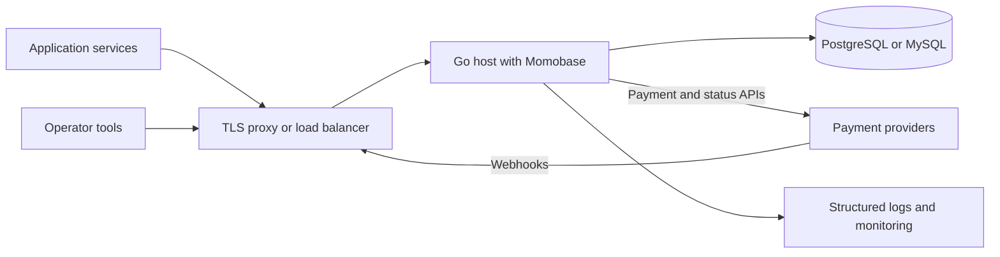

# Deploy a host application

Momobase is a Go package, so the application embedding it owns the executable, container image, process manager, and deployment topology.



SQLite is useful for local development and a single host. Use PostgreSQL or MySQL when multiple replicas need one shared database.

## Configure explicitly

Use `momobase.LoadConfig()` for environment-driven hosts or construct `momobase.Config` directly and pass it through `momobase.WithConfig`. Production and staging configurations reject default secrets, insecure public URLs, wildcard CORS, and remote PostgreSQL without TLS.

The complete environment baseline lives in [`.env.example`](https://github.com/momobasehq/momobase/blob/main/.env.example). Host applications decide whether and how to load `.env` files.

At minimum, set these values outside development:

```dotenv
APP_ENV=production
APP_PUBLIC_URL=https://payments.example.com
CORS_ALLOWED_ORIGINS=https://checkout.example.com
TRUSTED_PROXY_CIDRS=10.0.0.0/8

DB_TYPE=postgres
DB_HOST=database.internal
DB_PORT=5432
DB_USER=momobase
DB_PASSWORD=<database secret>
DB_NAME=momobase
DB_SSLMODE=require

ENCRYPTION_MASTER_KEY_BASE64=<base64-encoded 32-byte key>
ADMIN_OAUTH_SECRET=<at least 32 random characters>
APP_OAUTH_SECRET=<at least 32 random characters>
```

Keep the database password, encryption key, OAuth secrets, and provider configuration in a secret manager. Back up the encryption key with the database: the database alone cannot recover encrypted provider configuration.

## Control migrations

`Features.AutoMigrate` defaults to `true`. For controlled deployments, set it to `false` and run `instance.Migrate(ctx)` from a single migration process before serving traffic.

Back up the database and encryption key before applying a new release. Schema migrations do not provide automatic down migrations.

A controlled release sequence is:

1. Stop writes or ensure the release supports the current schema.
2. Back up the database and encryption key.
3. Run `Migrate(ctx)` from one process.
4. Deploy the serving processes after migration succeeds.

Do not run application replicas against a schema version their code does not support.

## Own the lifecycle

Call `instance.Serve(ctx)` when the host already manages cancellation, or `instance.Run()` for interrupt and termination signal handling. Always call `instance.Close()` after a successful `New`.

SQLite requires cgo. Applications using PostgreSQL or MySQL control their own build settings.

Allow the process enough termination grace for Momobase's 10-second HTTP shutdown window and any host cleanup. `Serve(ctx)` starts provider runtimes and workers only once, so restart by constructing a new instance.

## Assign worker ownership

Every serving process with workers enabled starts its own health, reconciliation, and cleanup loops. Momobase does not coordinate a distributed worker lease.

For multiple replicas, enable workers on one designated instance and set `WORKERS_ENABLED=false` on the others. Reassign that ownership during failover. Reconciliation is defensive against concurrent updates, but duplicate workers add provider traffic and operational noise.

## Configure probes

- Use `/ping` for process liveness.
- Use `/healthz` for a lightweight API readiness response.
- Use `/api/admin/system/health` for authenticated database and runtime diagnostics.
- Inspect `/api/admin/health/providers` separately because provider outages should not necessarily restart the process.

The first two endpoints do not call providers. See [Operate Momobase](/guide/operations) for diagnostic workflows.

## Operate safely

- Keep encryption and OAuth secrets outside source control.
- Terminate TLS before the API and set the public URL to HTTPS.
- Trust forwarded client addresses only from proxies listed in `TrustedProxyCIDRs`.
- Run migrations once before rolling out multiple application replicas.
- Assign background-worker ownership deliberately when running more than one replica.
- Monitor `/ping`, `/healthz`, provider health, reconciliation, and audit logs.

Also review the [configuration reference](/reference/configuration) and [HTTP limits](/reference/http-api#content-type-and-request-limits) before sizing a proxy or load balancer.
