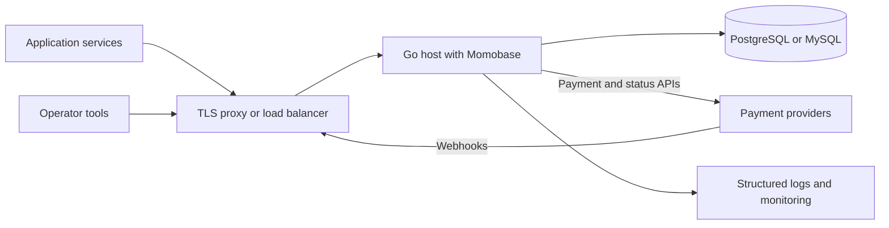

# Deploy a host application

Momobase is a Go package, so the application embedding it owns the executable, container image, process manager, and deployment topology.



SQLite is useful for local development and a single host. Use PostgreSQL or MySQL when multiple replicas need one shared database.

## Configure explicitly

Momobase reads no environment variables and no configuration files. Build a `momobase.Config` and pass it through `momobase.WithConfig`; where each value comes from is your application's decision.

```go
cfg := momobase.DefaultConfig()
cfg.App.Env = "production"
cfg.App.PublicURL = "https://payments.example.com"
cfg.App.CORSAllowedOrigins = []string{"https://checkout.example.com"}
cfg.App.TrustedProxyCIDRs = []string{"10.0.0.0/8"}

cfg.DB = momobase.DatabaseConfig{
	Type:     "postgres",
	Host:     "database.internal",
	Port:     "5432",
	User:     "momobase",
	Password: secret("DB_PASSWORD"),
	Name:     "momobase",
	SSLMode:  "require",
}

cfg.Security.EncryptionMasterKeyBase64 = secret("ENCRYPTION_MASTER_KEY")
cfg.Security.AdminOAuthSecret = secret("ADMIN_OAUTH_SECRET")
cfg.Security.AppOAuthSecret = secret("APP_OAUTH_SECRET")

instance, err := momobase.New(
	momobase.WithConfig(cfg),
	momobase.WithProvider("acme", acme.New),
)
```

`DefaultConfig()` is a development baseline: SQLite in `./data`, an all-zero encryption key, and placeholder token secrets. Production and staging configurations reject those defaults, insecure public URLs, wildcard CORS, and remote PostgreSQL without TLS, so a deployment that forgets one of them fails at startup rather than at the first payment.

Read secrets from your secret manager, environment, or deployment platform in the host — the [configuration reference](/reference/configuration#read-configuration-from-the-environment) shows the environment-variable version of the same function. Keep the database password, encryption key, OAuth secrets, and provider configuration out of source control.

## Generate the secrets

Mint the encryption key and both signing secrets once, before the first deploy:

```sh
$ openssl rand -base64 32
kEo8Xz2hQ9vTn4bWpL6yRc3mJf7sA1dZgU0iN5xVeQY=

$ openssl rand -hex 32
7c1a9f4e83b25d06ea4c17b98f3d0526ca8e71b4d92f6038ab5e4c17d0396f8a

$ openssl rand -hex 32
2f6b8d05c39a1e74fb0d62a85c197e34d0f8a2b61c95730ed48f2a6b039c5e17
```

Store them, then load them into `Config.Security`:

```go
cfg.Security.EncryptionMasterKeyBase64 = secret("ENCRYPTION_MASTER_KEY") // openssl rand -base64 32
cfg.Security.AdminOAuthSecret = secret("ADMIN_OAUTH_SECRET")             // openssl rand -hex 32
cfg.Security.AppOAuthSecret = secret("APP_OAUTH_SECRET")                 // openssl rand -hex 32
```

The encryption key must decode to exactly 32 bytes, so `-base64 32` is not a suggestion — `openssl rand -base64 24` produces a key that fails at startup. The OAuth secrets only need 32 characters or more. Use a different value for each of the three.

Back up the encryption key with the database: the database alone cannot recover encrypted provider configuration. A lost key means unreadable provider credentials, and re-encrypting requires re-entering every provider account's configuration.

## Control migrations

`Features.AutoMigrate` defaults to `true`. For controlled deployments, set it to `false` and run `instance.Migrate(ctx)` from a single migration process before serving traffic.

Back up the database and encryption key before applying a new release. Schema migrations do not provide automatic down migrations.

A controlled release sequence is:

1. Stop writes or ensure the release supports the current schema.
2. Back up the database and encryption key.
3. Run `Migrate(ctx)` from one process.
4. Deploy the serving processes after migration succeeds.

Do not run application replicas against a schema version their code does not support.

## Own the lifecycle

Call `instance.Serve(ctx)` when the host already manages cancellation, or `instance.Run()` for interrupt and termination signal handling. Always call `instance.Close()` after a successful `New`.

SQLite requires cgo. Applications using PostgreSQL or MySQL control their own build settings.

Allow the process enough termination grace for Momobase's 10-second HTTP shutdown window and any host cleanup. `Serve(ctx)` starts provider runtimes and workers only once, so restart by constructing a new instance.

## Assign worker ownership

Every serving process with workers enabled starts its own health, reconciliation, and cleanup loops. Momobase does not coordinate a distributed worker lease.

For multiple replicas, enable workers on one designated instance and set `Workers.Enabled` to `false` on the others. Reassign that ownership during failover. Reconciliation is defensive against concurrent updates, but duplicate workers add provider traffic and operational noise.

## Configure probes

- Use `/ping` for process liveness.
- Use `/healthz` for a lightweight API readiness response.
- Use `/api/admin/system/health` for authenticated database and runtime diagnostics.
- Inspect `/api/admin/health/providers` separately because provider outages should not necessarily restart the process.

The first two endpoints do not call providers. See [Operate Momobase](/guide/operations) for diagnostic workflows.

## Operate safely

- Keep encryption and OAuth secrets outside source control.
- Terminate TLS before the API and set the public URL to HTTPS.
- Trust forwarded client addresses only from proxies listed in `App.TrustedProxyCIDRs`.
- Run migrations once before rolling out multiple application replicas.
- Assign background-worker ownership deliberately when running more than one replica.
- Monitor `/ping`, `/healthz`, provider health, reconciliation, and audit logs.

Also review the [configuration reference](/reference/configuration) and [HTTP limits](/reference/http-api#content-type-and-request-limits) before sizing a proxy or load balancer.
