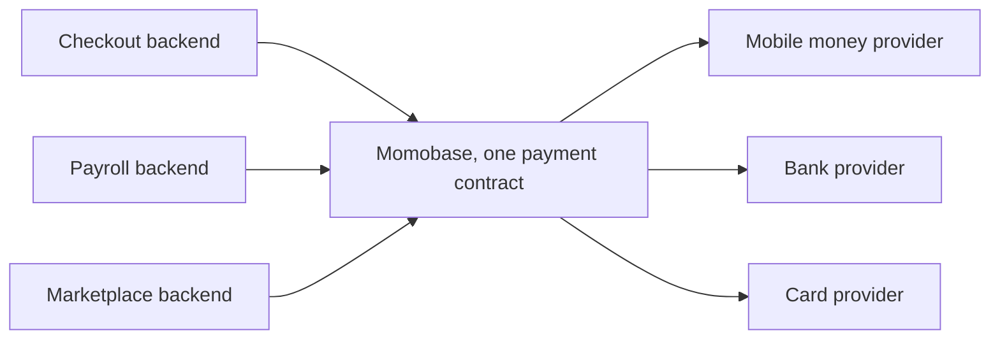
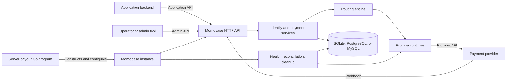

# Understand Momobase

Momobase is a self-hosted payment orchestration service. Applications send collections and disbursements to one API, and Momobase routes each request through an eligible provider account.

Use Momobase when you need one payment contract across several providers while retaining control of credentials, routing, transaction records, and deployment. Momobase is not a payment provider, merchant of record, checkout interface, or order-management system.

Every application sends its collections and disbursements to the same API. Momobase narrows that traffic into one payment contract, then fans each request out to the provider account that can settle it.

## Runtime model

One process runs one Momobase instance with a set of provider adapters compiled into it. The instance owns its HTTP API, payment services, provider runtimes, workers, hooks, and database connections.

That process is either [Momobase Server](/server/), which is published ready to run, or a Go program of your own that [embeds the library](/library/). Both are the same runtime; they differ only in who compiles it and where configuration comes from.

The main runtime parts are:

| Part              | Responsibility                                                                                                   |
| ----------------- | ---------------------------------------------------------------------------------------------------------------- |
| HTTP API          | Authenticates applications and administrators, validates requests, and exposes payment and operational endpoints |
| Payment services  | Apply idempotency, select routes, call providers, and persist legal transaction transitions                      |
| Provider runtimes | Hold initialized provider adapters, health state, and circuit-breaker state for active accounts                  |
| Workers           | Check provider health, reconcile unresolved transactions, and remove expired sessions                            |

The host process owns startup, provider selection, deployment, and shutdown. Momobase owns everything the instance creates, and releases it on shutdown.

## Core concepts

- An **application** represents one API consumer and fixes the currency accepted for its payments.
- An **application credential** grants selected application scopes and is exchanged for access and refresh tokens.
- A **provider adapter** implements the Go interfaces needed to talk to one upstream payment system.
- A **provider account** combines an adapter code with encrypted configuration, an environment, one country, one currency, and fee rules.
- A **route** connects a service and payment method to one provider account at a priority.
- A **transaction** is Momobase's normalized record of a collection or disbursement.
- A **transaction attempt** records the provider call used to process a transaction.

Read [Payment lifecycle](/guide/payment-lifecycle) for the request and recovery paths, and [Routing](/guide/routing) for route eligibility and fallback behavior.

## Trust boundaries

Application clients authenticate with client credentials and scopes. Administrators authenticate separately and receive permissions through roles. Provider configuration is encrypted before persistence and is never returned through the Admin API.

Momobase validates its normalized payment contract. The selected provider adapter owns provider-specific validation for values such as phone numbers, bank accounts, card tokens, wallet addresses, and schemes.

Webhook processing has two authentication layers: Momobase checks the provider account's `webhook_secret`, then the adapter verifies the provider's signature or equivalent proof using the raw body and headers.

## Persistence and recovery

Momobase stores applications, credentials, routing configuration, transactions, attempts, webhook deliveries, health snapshots, sessions, and audit records in SQLite, PostgreSQL, or MySQL.

Provider network calls do not run inside database transactions. The transaction and its initial attempt are committed first; the provider result is persisted afterward. If the outcome is unresolved, reconciliation queries the provider with bounded backoff. Verified webhooks can also advance the same transaction.

All status updates use the same transition rules, whether the source is the initial request, a webhook, or reconciliation. Duplicate payment requests and webhooks are handled idempotently.

## Next

- [Choose your integration](/guide/choose) — the server, the Go package, or both.
- Read the [payment lifecycle](/guide/payment-lifecycle) for the request and recovery paths, and [routing](/guide/routing) for eligibility and fallback.
- [Create your first payment](/guide/first-payment) against a running instance.
