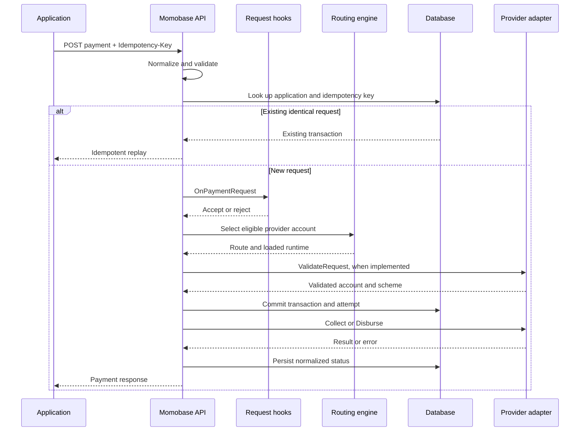
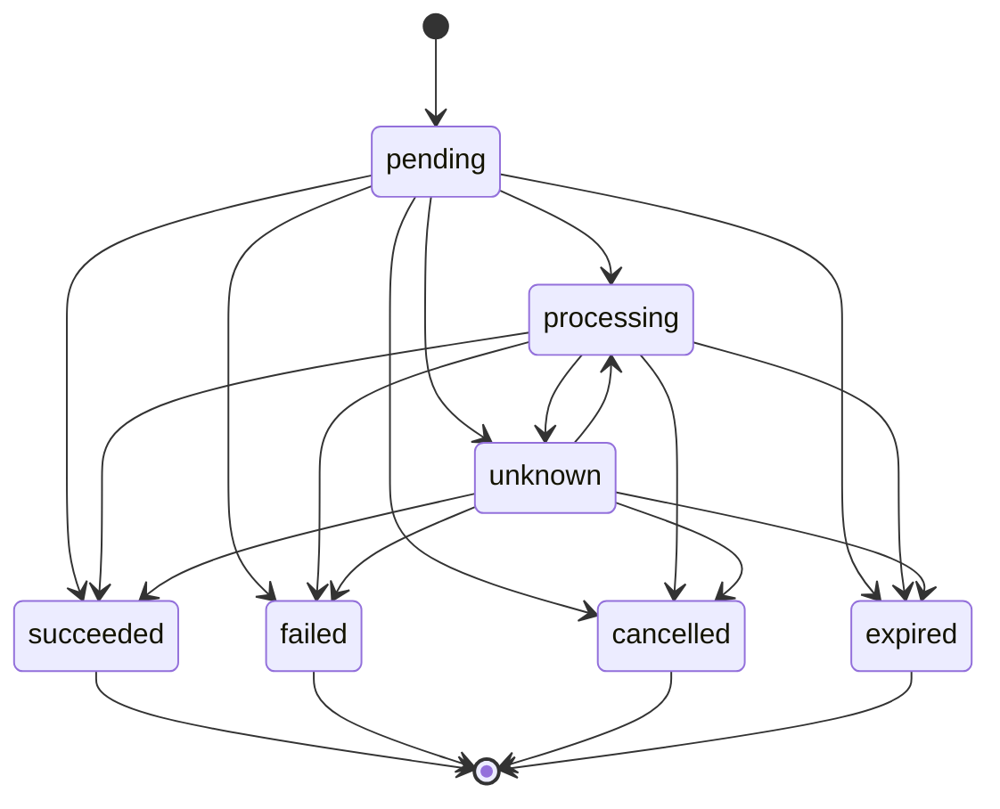

# Payment lifecycle

Momobase turns one application request into a normalized transaction, a provider attempt, and zero or more later status updates. This page explains why each stage exists and how uncertain provider outcomes recover.

## Initial request

An authenticated application submits a collection or disbursement with an `Idempotency-Key`. Momobase then follows this sequence:

The provider network call happens after the transaction and initial attempt commit. It never runs inside a database transaction.

## Validation and normalization

Momobase validates the fields shared by every provider:

- `payment_method` is `momo`, `card`, `bank_transfer`, or `wallet`;
- `amount` is a positive integer in the currency's minor unit;
- `currency` has three characters and matches the application's currency;
- `country` is an ISO 3166-1 alpha-2 code;
- `reference` and `account` are present; and
- text fields satisfy their length and shape limits.

The request is normalized before its idempotency hash is calculated. Currency and country become uppercase, while payment method and scheme become lowercase. The account is trimmed but retains its case because provider identifiers may be case-sensitive.

After routing, an adapter that implements `providers.RequestValidator` can validate and normalize the provider-specific `account` and `scheme`. It cannot change the amount, currency, country, reference, payment method, or transaction ID.

## Idempotency

The `Idempotency-Key` is required for every collection and disbursement. Its scope is one application.

- Repeating the same normalized request with the same key returns the stored transaction without calling hooks or the provider again.
- Reusing the key with a different request fails.
- Concurrent requests using the same key converge on the transaction protected by the database uniqueness constraint.

Use a stable business-operation identifier as the key. Keep the payload unchanged across retries.

## Transaction states

All request, webhook, and reconciliation updates use the same legal transition graph:

Applying the current state again is a no-op. `succeeded`, `failed`, `cancelled`, and `expired` are terminal and cannot transition further.

## Provider result

The selected adapter returns its provider reference, status, message, and optional structured raw response. Momobase maps common provider status names to its transaction states. Adapters with bespoke upstream codes should map them to the exported `providers.Tx*` constants themselves.

If the provider call fails or returns no response, Momobase records the transaction as `unknown` and schedules reconciliation. Provider errors are redacted before persistence and logging.

After a committed status change, `OnTransactionChanged` observers receive the previous status, new status, source, transaction identifiers, routing identifiers, amount, and currency. Observer failures are logged and cannot roll back the committed change.

## Webhook path

Providers send callbacks to `POST /webhooks/:providerAccountID`. Momobase first checks the account's `X-Webhook-Secret`, then gives the raw body and headers to the adapter's `VerifyWebhook` implementation.

A verified event is stored idempotently before it is applied. When supplied, its amount, currency, country, external reference, and account must match the transaction. Events that arrive before their provider reference can be matched remain pending and are retried by reconciliation.

## Reconciliation path

The reconciliation worker selects non-terminal transactions whose next check is due and calls `QueryTransaction` on the original provider account. It locks and re-reads each transaction before applying the result, preventing a late poll from overwriting a webhook or request result that committed first.

Unresolved checks use an exponential delay capped at 32 minutes. Terminal results clear the next reconciliation time. The same worker also retries stored webhook events that have not yet matched a transaction.

See [Operate Momobase](/guide/operations) for worker and provider-health checks.
