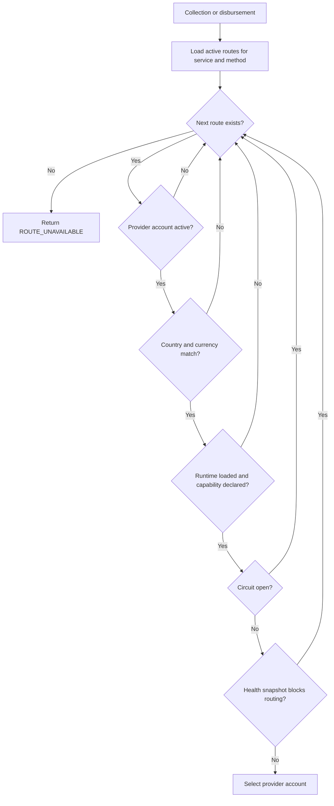

# Routing payments

Routing connects a normalized payment request to one loaded provider account. It is deterministic: Momobase considers active routes in ascending priority order, then chooses the oldest route when priorities are equal.

## Route selection

A route is eligible only when all of these conditions hold:

1. The route is active and matches the requested service and payment method.
2. Its provider account is active.
3. The provider account's country and currency match the payment.
4. The provider account has an initialized runtime.
5. The adapter declares the matching service and payment-method capability.
6. The in-memory circuit is not open.
7. The latest health snapshot is not `down`, `disabled`, or `misconfigured`, and its recorded circuit is not open.

A provider that has never been health-checked has no snapshot. That first-run state does not block routing.

## Priority and fallback

Lower numeric values have higher preference. Routes with the same priority are tried from oldest to newest. If a candidate fails an eligibility check, selection continues to the next route.

Fallback happens during selection only. Once Momobase commits a transaction and attempt for a selected account, it does not send that transaction to a different provider because the provider call fails. An uncertain outcome must be reconciled against the original provider to avoid duplicate money movement.

## Payment-method discovery

`GET /api/v1/payment-methods` uses the same candidate checks as payment creation. It reports a service and payment-method pair when at least one route could handle it at that moment.

The endpoint can filter by `service_type` and `country`. Currency comes from the authenticated application. Schemes are absent because they are free-form provider values rather than routing criteria.

Availability can change after discovery because an operator may change a route or provider account, or provider health may deteriorate. The payment request remains authoritative.

## Provider capabilities

Capabilities come from the adapter after `Init`. Each capability is one service and payment-method pair. Momobase rejects an invalid provider runtime when:

- it declares an unsupported service or payment method;
- it declares a collection without implementing `Collector`;
- it declares a disbursement without implementing `Disburser`;
- it exposes payment capabilities without implementing `TransactionQuerier`; or
- it declares the same capability more than once.

Routes can be created only for an active, loaded provider account and one of its declared capabilities.

## Health and circuit breaking

Provider calls use a 45-second bounded context. Three consecutive provider-operation failures open the account's in-memory circuit for 30 seconds. After that interval, one half-open probe is allowed: success closes the circuit, while failure opens it again.

Caller cancellation does not count as a provider failure. Provider-request validation also bypasses the circuit because invalid customer data is not evidence of an upstream outage.

The health worker separately records provider reachability. Three consecutive failed checks, or an open circuit, marks the provider down and removes its routes from consideration until health recovers.

## Diagnose an unavailable route

Check, in order:

1. The application's currency and the payment country.
2. The requested service and payment method.
3. The route's active state and priority.
4. The provider account's active state, country, and currency.
5. The runtime's initialization state and capabilities.
6. The latest provider health and circuit state.

The [operations guide](/guide/operations) lists the Admin API resources that expose this state.
