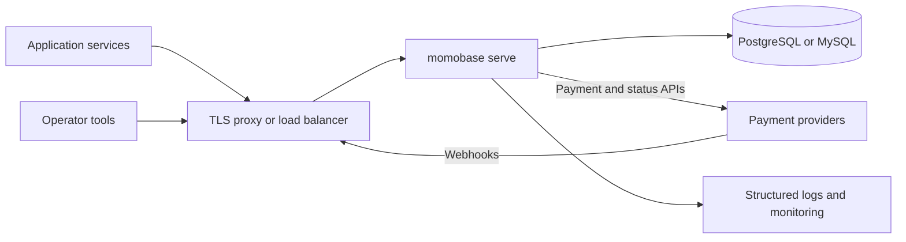

# Deploy the server



Set `APP_ENV=production` before anything else. It turns the [validation gates](/server/configuration#staging-and-production-validation) on, so a deployment that forgot a secret or left TLS off fails at start-up rather than at the first payment.

## Choose a database

SQLite is right for local development and for a single host that will stay single. Use PostgreSQL or MySQL as soon as more than one replica needs a shared view of transactions.

The container keeps its SQLite file in the `/data` volume. Mount that volume, or the database disappears with the container:

```sh
-v momobase-data:/data
```

For PostgreSQL, set `DB_SSLMODE=require`. Validation rejects `disable` in production for any host other than `db`, `localhost`, or `127.0.0.1`.

## Terminate TLS in front

The server does not terminate TLS. Put a proxy or load balancer in front of it, and tell the server about it:

- `APP_PUBLIC_URL` must be the `https://` URL callers actually reach.
- `TRUSTED_PROXY_CIDRS` must list the proxy addresses whose forwarded headers may be believed.
- `CORS_ALLOWED_ORIGINS` must name the browser origins that call the API, not `*`.

Leaving `TRUSTED_PROXY_CIDRS` empty behind a proxy is the failure worth watching for: every request then appears to come from the proxy, so rate limiting keys the entire internet into a single bucket. Setting it too widely is the opposite failure — forwarded headers are forgeable, so list only proxies you control.

Review the [request and rate limits](/api/conventions#content-type-and-request-limits) before sizing the proxy.

## Control migrations

`AUTO_MIGRATE` defaults to `true`, which is correct for a single instance. For a controlled rollout set it to `false` and migrate deliberately: the server then logs any pending migrations by name and starts without applying them.

Migrations are forward-only. There are no automatic down migrations.

1. Back up the database and the encryption key.
2. Confirm the running release tolerates the new schema, or stop writes.
3. Start one instance with `AUTO_MIGRATE=true` and let it exit, or run one replica ahead of the others.
4. Roll out the remaining replicas once migration has succeeded.

Never run replicas against a schema version their code does not support.

## Assign worker ownership

Every process with `WORKERS_ENABLED=true` runs its own health, reconciliation, and cleanup loops. There is no distributed lease — the server does not coordinate ownership between replicas.

Run multiple replicas with `WORKERS_ENABLED=true` on exactly one, and `false` on the rest. Reassign that role during failover. Reconciliation defends itself against concurrent updates, so duplicates are not corrupting, but they multiply provider traffic and operational noise.

## Configure probes

| Endpoint                      | Use for                               | Authenticated |
| ----------------------------- | ------------------------------------- | ------------- |
| `/ping`                       | Process liveness                      | No            |
| `/healthz`                    | API readiness                         | No            |
| `/api/admin/system/health`    | Database and runtime diagnostics      | Yes           |
| `/api/admin/health/providers` | Per-provider health and circuit state | Yes           |

The container's own health check calls `/healthz`. Neither `/ping` nor `/healthz` calls a provider, which is deliberate: a provider outage must not restart the process. Alert on provider health separately.

## Scale and restart

The API is stateless apart from the database, so replicas scale horizontally once workers are assigned. Allow enough termination grace for the 10-second HTTP shutdown window.

## Providers are compiled in

The published build registers only `dummy`. Running a real payment rail means forking the repository, adding the adapter to `providers/providers.go`, and building your own image — or [embedding the library](/library/) instead and keeping your own `main()`. [Compare the two](/guide/choose).

## Before going live

- Keep the encryption key and OAuth secrets out of source control.
- Back up the encryption key alongside the database.
- Terminate TLS and set `APP_PUBLIC_URL` to the HTTPS address.
- List real proxies in `TRUSTED_PROXY_CIDRS` and real origins in `CORS_ALLOWED_ORIGINS`.
- Migrate once before rolling out replicas.
- Enable workers on exactly one replica.
- Monitor `/ping`, `/healthz`, provider health, reconciliation, and audit logs.
- Exercise provider failure behavior before moving money.

[Operating the server](/server/operations) covers the diagnostic workflows for when one of these goes wrong.
