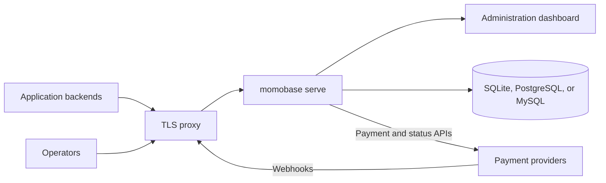

# Momobase Server

<div style="display:flex;gap:1rem;">

[](https://github.com/momobasehq/server/releases/latest)

[](https://github.com/momobasehq/server/pkgs/container/server)

[](https://github.com/momobasehq/server/actions/workflows/ci.yml)

[](https://github.com/momobasehq/server/blob/main/LICENSE.txt)

</div>

```sh
docker run -p 9090:9090 -v momobase-data:/data ghcr.io/momobasehq/server
```

Momobase Server is the runnable distribution: the HTTP API, the provider adapters compiled into it, and the administration dashboard, in one binary. Run it as a service and integrate over HTTP.

It is published as a container image and as signed archives for Linux, macOS, and Windows. Configuration comes from the environment rather than from code, so nothing here needs a Go toolchain.



## What it adds to the library

The server wraps [the Go library](/library/) and supplies the parts a library cannot: a command-line interface, environment-based configuration, a `.env` loader, and the compiled dashboard bundle. The payment engine, HTTP API, and database schema are the library's.

## Compiled providers

A build can only execute the adapters compiled into it. Since v0.3.0 the published builds register the [official providers](/library/official-providers) alongside `dummy`:

| Code          | Provider          | Collections        | Disbursements | Verified webhooks |
| ------------- | ----------------- | ------------------ | ------------- | ----------------- |
| `dummy`       | In-tree simulator | Simulated          | Simulated     | No                |
| `mtn`         | MTN MoMo          | Mobile money       | Mobile money  | No                |
| `airtel`      | Airtel Money      | Mobile money       | Mobile money  | No                |
| `yopayments`  | Yo! Payments      | Mobile money       | Mobile money  | No                |
| `marzpay`     | MarzPay           | Mobile money, card | Mobile money  | Yes               |
| `flutterwave` | Flutterwave       | Mobile money       | Mobile money  | Yes               |

The first column is the provider code an operator selects when creating a provider account. Registering an adapter costs nothing until an account exists for its code, and each account is configured entirely through the Admin API — no rebuild, and no credentials in the environment.

`dummy` is a deterministic simulator that moves no money, so a fresh deployment can still be exercised end to end before any real credentials exist.

::: warning The official providers are under testing
Most of these adapters have not yet run against a real merchant account in every market they target. Treat them as unproven against live money: start in each provider's sandbox, and note that MarzPay has no sandbox endpoint — its adapter always calls the live API.

[TESTING.md](https://github.com/momobasehq/providers/blob/main/TESTING.md) explains what most needs testing and how to report what you find.
:::

::: info Any other provider means rebuilding
Provider adapters are compiled in, not loaded at runtime. To run a rail outside the table above you fork the server repository, add the adapter to `providers/providers.go`, and build your own image or binary — or [embed the library](/library/) directly and keep your `main()`.

If your adapters are private or change often, the library is the better fit. [Compare the two](/guide/choose).
:::

## Next

- [Install the server](/server/install) with Docker or a release binary.
- [Configure it](/server/configuration) for anything beyond a local trial.
- [Create your first payment](/guide/first-payment) once it is running.
